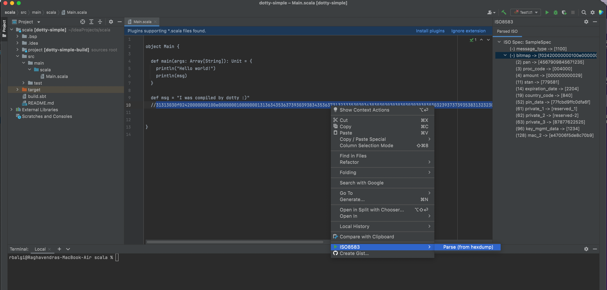

# intellij-iso8583-plugin
Intellij plugin to parse ISO8583 traces from within the IDE



## Dependencies
* [https://github.com/rkbalgi/iso4k]() - Build and install locally in maven repo

## Building
```bash
$ ./gradlew buildPlugin
#install this in your ide
$ ls build/distributions/iso8583parser-1.0.0.zip 
```